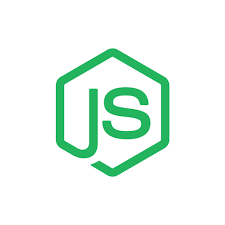

## Hello World :sparkling_heart: 👋🏽 

### :open_book: :books: Skills :closed_book: :green_book:

#### Programming

<code></code>
<code></code>
<code></code>
<code></code>
<code></code>
<code></code>

#### DevOps

<code></code>
  <code></code>
  <code></code>
  <code></code>
  <code></code>
  <code></code>

#### Continuous Integration and Continuous Delivery

<code></code>
  <code></code>
  <code></code>
  <code></code>
  <code></code>

#### Cloud Computing & IaaS

  <code></code>
  <code></code>
  <code></code>
  <code></code>
  <code></code>
  <code></code>

#### Web Development

  <code></code>
  <code></code>
  <code></code>
  <code></code>
  <code></code>
  <code></code>
  <code></code>

### I :heart: GitHub :octocat:

### Achievements and Milestones :crown:

:1st_place_medal:	University Top Ranker, School of Computer Science, [University of Petroleum and Energy Studies](https://www.upes.ac.in/)

:trophy: Intern of the Month (August 2019) [@OpenGenus](https://www.github.com/OpenGenus)

:tada: Top 100 in GitHub Actions Hackathon 2020 

:sparkles: Completed #100DaysofCode #100DaysofMLCode and #301DaysofCode challenges.

### Work Experience :computer_mouse: :desktop_computer: :keyboard:

| Position | Organization | Timeline |
| :- | :- | :- |
| Developer Evangelist | [@statusneo](https://statusneo.com) | June 2020 - July 2020 |
| DevOps Intern | [@xebia](https://xebia.com/) | April 2020 - June 2020 |
| Mentor for RGSoC 2020 | [@OpenGenus](github.com/OpenGenus) | Feb 2020 - June 2020 |
| Software Developer Intern | [@OpenGenus](github.com/OpenGenus) | July 2019 - Sept 2019 |
| Project Development Lead | [@upes-open](https://github.com/upes-open) | Jan 2019 - June 2019 |

## Let's Connect :people_holding_hands:

&nbsp;&nbsp;

