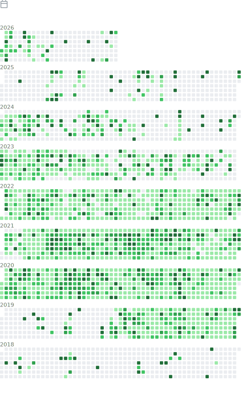

  

---

# Hey, I'm Nish 👋

> *Day 0 engineer → Fortune 500 platforms → $7M saved → still writing code at midnight.*  
> *GitHub Star 3x ⭐ | New York*

---

## 🧠 What I Do

I'm a **Staff Platform Engineer** building infrastructure that Fortune 500 companies 
run on. Right now I'm at **Caesars Entertainment** — designing the cloud backbone 
for regulated sports betting across 35 US states.

Things I've shipped that actually matter:

- 💰 **$7M in AWS savings** through Graviton migration, FinOps automation, and 
  platform consolidation
- 🔧 **96% reduction in production incidents** by rebuilding reliability from 
  reactive firefighting to self-healing systems
- 🚀 **Developer platforms serving 2000+ engineers** — cutting onboarding from 
  4 weeks to 3 days
- 🤖 **AI-powered FinOps tool** using AWS Bedrock that identifies cost waste 
  automatically — $2M found so far
- ✈️ **Flew to 3 continents** to talk about Platform Engineering, SRE, and 
  open source (ask me about London and Seattle)

---

## 🌟 GitHub Stars (2021 · 2022 · 2023)

One of 89 engineers worldwide recognized by Microsoft with the GitHub Stars Award 
three years in a row. Not for the commits — for teaching 1000+ students open source, 
establishing GitHub × Linux Foundation university partnerships, and helping enterprises 
adopt GitHub Enterprise across India.

<table>
  <tr>
    <td align="center">
      
    </td>
    <td align="center">
      
    </td>
    <td align="center">
      
    </td>
  </tr>
</table>

---

---

## 📈 GitHub Activity

  
Profile Stats

  

    
  

  
Contribution Stats

  

    
  

---

## 🎤 Where You Might Have Seen Me

- **GitHub Universe San Fracisco**
- **SREDays NYC**
- **SREDays London**
- **SREDays Seattle**
- **GitHub Satellite India**

---

## 📬 Let's Talk

If you're building platforms, cutting cloud costs, or figuring out 
how to make 2000 engineers happier — I'm probably interested.

---

  <i>"Still the same kid who fell in love with open source."</i>

