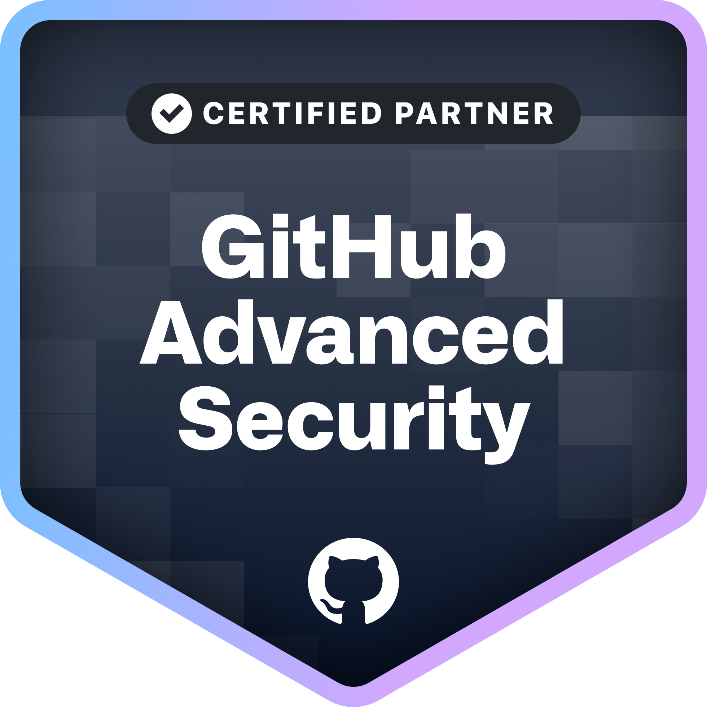

Hey there 👋

I'm Nish, a passionate Platform Engineering Architect with expertise in building secure and scalable enterprise solutions. I leverage DevSecOps principles, GitHub Enterprise, and Backstage.io to empower developers.

Currently, I lead the DevOps & Platform Center of Excellence (CoE) at StatusNeo. The CoE guides clients on their Cloud Native journey, helping them prioritize Developer Experience.

I'm a strong believer in a holistic DevOps approach that goes beyond tools and jargon. My focus is on CALMS:

- Culture of Collaboration
- Automation with Cutting-Edge Tech
- Lean Principles
- Measurement (DORA Metrics)
- Sharing Knowledge

At StatusNeo, we built an internal developer platform with Backstage.io, a single pane of glass for managing software catalogs, saving engineers valuable time.

---

<table>
  <tr>
    <td align="center">
</img>
</td>
</td>
<td align="center">
</img>
</td>							     <td align="center">
</img>
</td>
								     <td align="center">
</img>
</td>
</table>

---

<h3 align=center> I :heart: GitHub :octocat: </h3>

<table>
  <tr>
    <td align="center">
</img>
</td>
<td align="center">
</img>
</td>
</table>

 
	
Profile Stats

	

 
	
GitHub Contribution Stats - Yearly

	

 
	
GitHub Skyline 2022

	

 
	
GitHub City 2022

	

 
	
Recently Starred Repositories

	

 
	
GitHub Profile Trophies

	

