🚀 Meet Nishkarsh Raj: DevSecOps Evangelist, GitHub Star, and Open-Source Trailblazer

Nishkarsh Raj, a dynamic force in the world of DevSecOps and Developer Experience Advocacy, stands at the forefront of innovation as the Principal Evangelist & Consultant for StatusNeo Inc. With an unparalleled commitment to the open-source ethos, Nishkarsh has garnered accolades such as the prestigious GitHub Stars Award, an honor he has achieved for three consecutive years from 2021 to 2023.

🌟 A GitHubber Extraordinaire:

Nishkarsh's deep-rooted passion for open-source practices and GitHub is evident through his unwavering dedication to the platform over the years. Through his remarkable contributions, he has become a beacon of inspiration for developers across the globe. Armed with a wealth of experience and expertise, he channels his enthusiasm into organizing meetups, delivering compelling talks at conferences, and actively encouraging others to embrace the transformative #100DaysofCode challenge.

💡 Empowering the Open-Source Community:

With a fervent belief in the power of collaboration, Nishkarsh has become a driving force in inspiring aspiring developers to embark on their open-source journeys. Through his relentless advocacy, he highlights the significance of working together, sharing knowledge, and creating a nurturing environment that fosters growth and learning for all.

🎤 Inspiring Minds, Transforming Futures:

Nishkarsh's passion extends beyond his exceptional technical acumen; he possesses the rare ability to connect with people, inspire greatness, and ignite the spark of innovation within them. Whether on stage or in intimate meetups, his dynamic presence captivates audiences and motivates brilliant minds to dive headfirst into open-source projects, realizing their potential as contributors to the global developer community.

🌐 Embracing the Spirit of Open Source:

As a DevSecOps Evangelist, Nishkarsh exemplifies the essence of open-source values, propelling the world of technology toward greater collaboration and transparency. He believes that open-source is not just a methodology, but a philosophy that fosters an ecosystem where every individual can participate, learn, and make a profound impact.

---

<table>
  <tr>
    <td align="center">
</img>
</td>
</td>
<td align="center">
</img>
</td>							     <td align="center">
</img>
</td>
								     <td align="center">
</img>
</td>
</table>

---

<h3 align=center> I :heart: GitHub :octocat: </h3>

<table>
  <tr>
    <td align="center">
</img>
</td>
<td align="center">
</img>
</td>
</table>

 
	
Profile Stats

	

 
	
GitHub Contribution Stats - Yearly

	

 
	
GitHub Skyline 2022

	

 
	
GitHub City 2022

	

 
	
Recently Starred Repositories

	

 
	
GitHub Profile Trophies

	

